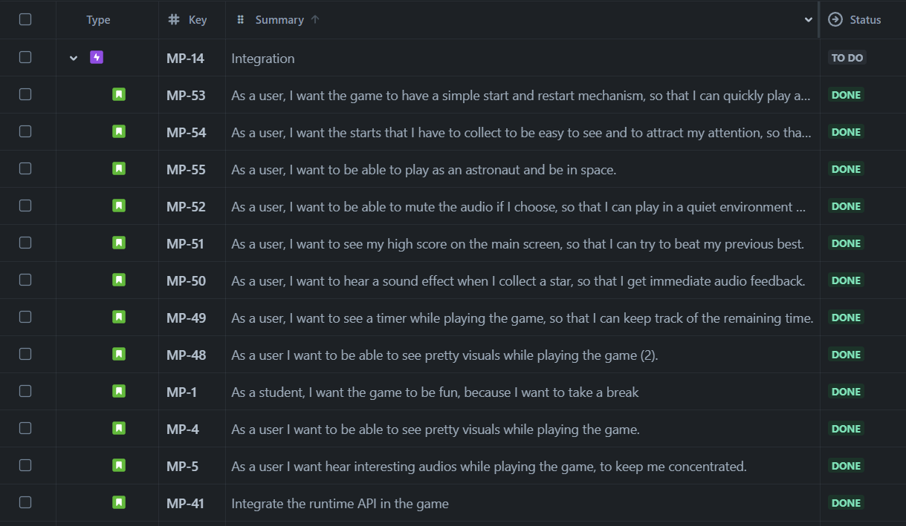
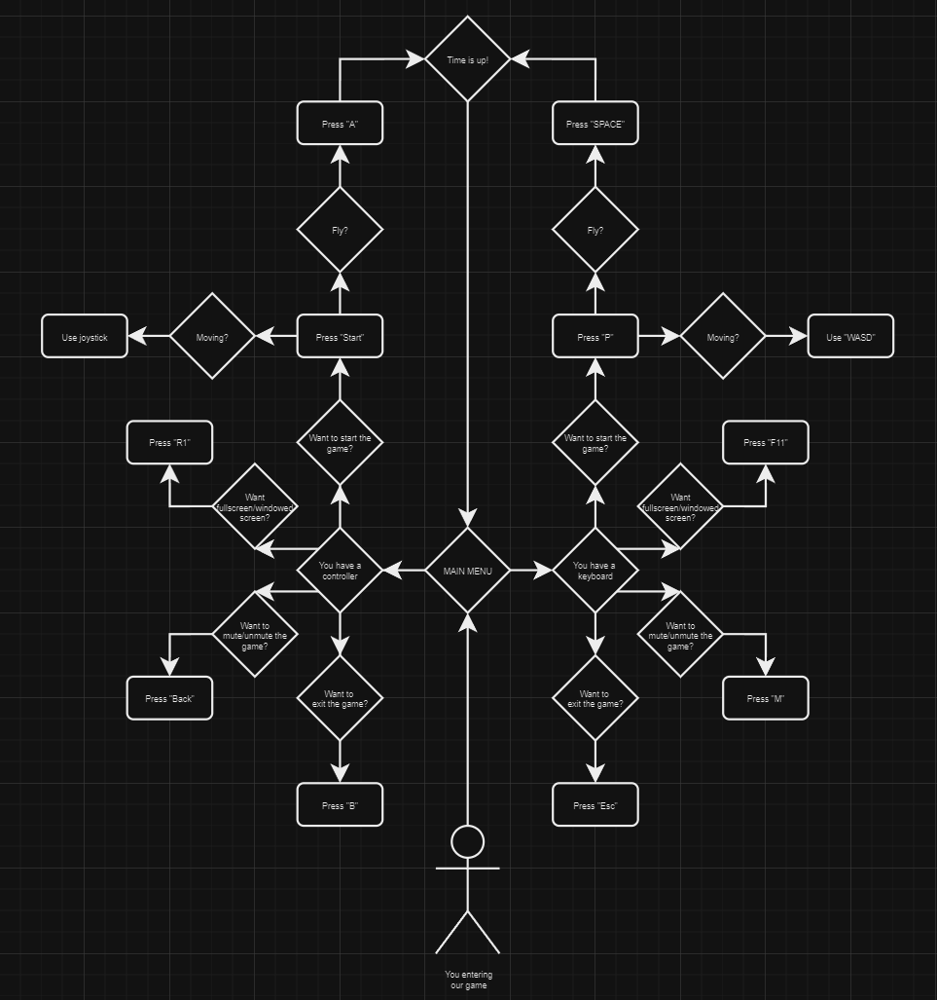
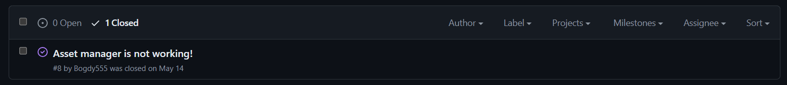
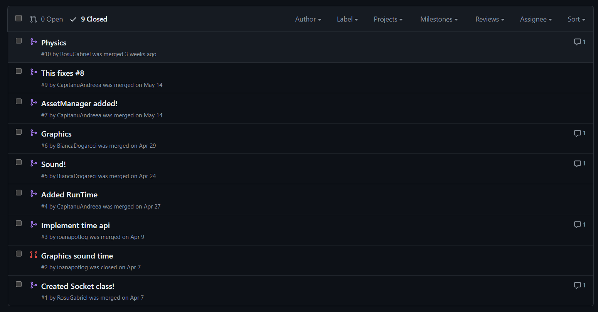
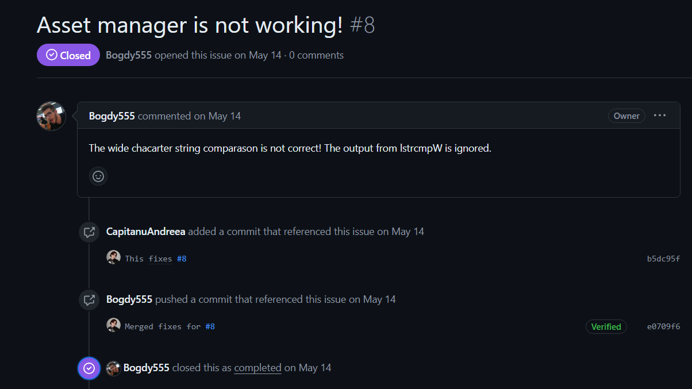
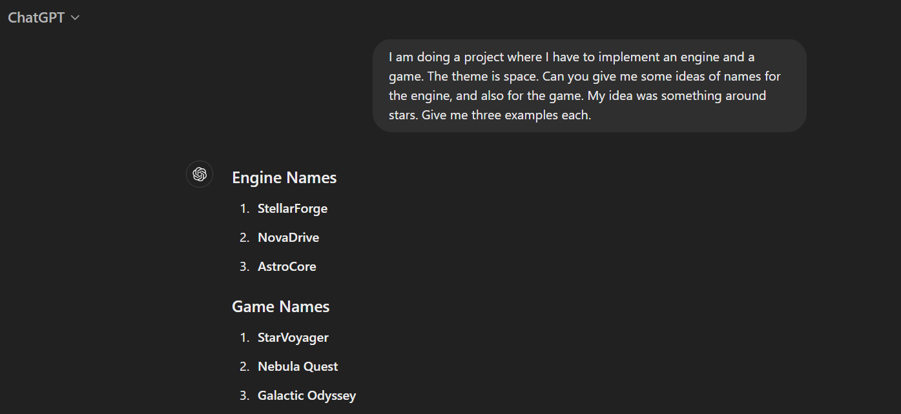

# Stellaris
In a distant galaxy, a brave astronaut embarks on a crucial mission to collect stars that power his home planet. With each star he gathers, he brings hope and light to his world, ensuring the survival of his people. Equipped with a jetpack, the astronaut must navigate the vastness of space and collect as many stars as possible within a minute. Every second counts in this thrilling adventure to save his planet from the brink of darkness.

# Description
Our team developed a custom game engine from scratch using C++ and integrated it with OpenGL for advanced graphics rendering. 

# Demo
[Stellaris Youtube Demo](https://www.youtube.com/watch?v=7bD3w1Pd9B0)

# Tasks
- User Stories:
  


- Diagrams:
  
UML Activity Diagram

  
- Source control with git:
  - issues:

  - pull request:


- [UnitTests](https://github.com/Bogdy555/Stellaris/blob/Master/UnitTests/Sources/EntryPoint.cpp):

We implemented unit tests for the mathematics engine, asset manager, and physics engine. At the end of the tests, we log the results to identify any failures, ensuring robust functionality across all components. This process helps us quickly locate and fix any issues to maintain the integrity of our engine.

- Bugs report and fixing them with pull request:
  


- Refactoring:

We all used the same coding style to improve readability, maintainability, and performance. Key elements:

Modular Code Structure - We divided our codebase into well-defined modules, each responsible for a specific functionality. This modular approach helps in managing the code more effectively and makes it easier to maintain and extend.

Naming Conventions - we used the _ prefix for local variables to distinguish them from class members and global variables, enhancing code readability and preventing naming conflicts; also all variable names start with a capital letter to maintain consistency and improve clarity.

The [commit a8d98ae](https://github.com/Bogdy555/Stellaris/commit/a8d98ae315f394ca7b7d4bf9af1e6a1c2c7f62d4) demonstrates a significant refactoring effort.

- Design patterns: Singleton
```c++
public:
    Application(const Application& _Other) = delete;
    Application(Application&& _Other) noexcept = delete;

    static Application* GetInstance();

private:
    Application();
```

- Use of AI tools:

We used ChatGPT for asking a variety of questions for our project. ChatGPT helped us with more creative things like ideas about our engine's name, to more technical information like parameters for specific functions and making a graphic window. In time, we realised that using the documentation is more reliable.



- Classes overview - Modular Design:

[Headers Stellaris Dependencies](https://github.com/Bogdy555/Stellaris/blob/Master/Stellaris/Headers/Stellaris_Dependencies.hpp)

[Headers AuroraCore Dependencies](https://github.com/Bogdy555/Stellaris/blob/Master/AuroraCore/Headers/AuroraCore_Dependencies.hpp)

# Contributors
- Căpitanu Andreea
- Dogăreci Bianca Alexandra
- Florescu Bogdan Ilie
- Potlog Ioana
- Roșu Gabriel Cătălin
